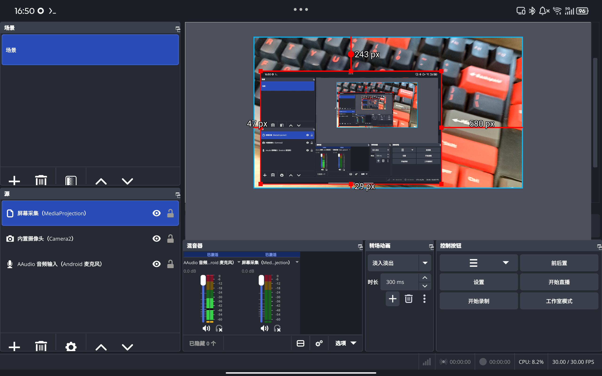
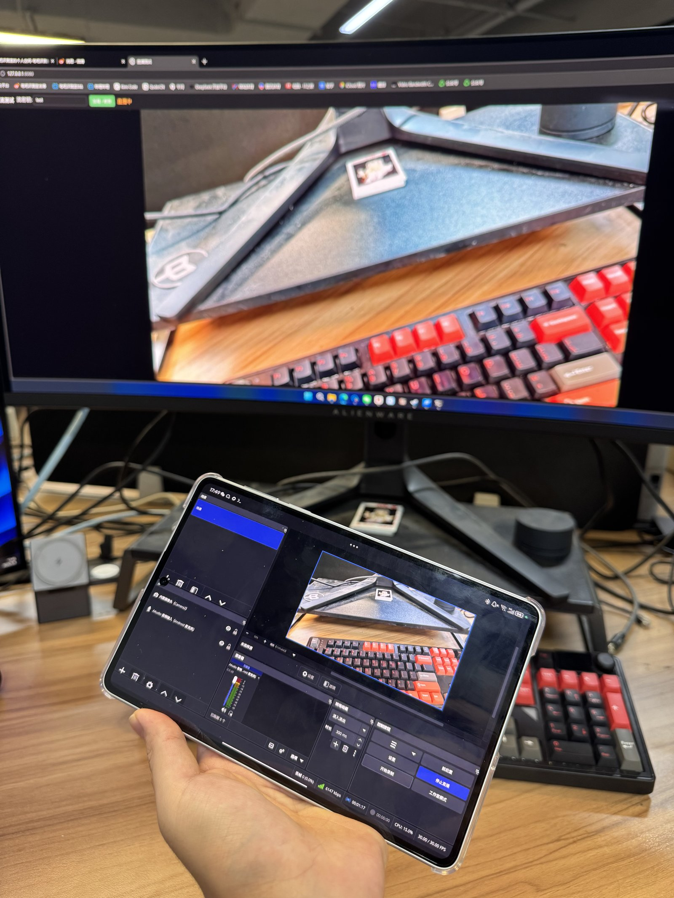

# OBS Studio for Android

**[English](README.md)** | 简体中文

把 [OBS Studio](https://github.com/obsproject/obs-studio) 移植到 Android 的工作分支。当前基线是上游 **32.2.1**（commit `57bfcf10a`），在其之上提供：`libobs` 的 Android 平台层、GLES/EGL 渲染后端、Qt 前端的 Android 适配、四个 `android-*` 采集插件，以及 APK 侧的 Java 宿主。

目标是**能录、能推、能用的安卓端 OBS**，而不是演示品。开发与验证全部在 **WSL2 + arm64 真机** 上进行。



RTMP 局域网直播实测——平板以约 6 Mbps / 30 FPS 推摄像头画面，后方显示器上是接收端播放的实时流：



> **English (TL;DR)** — An Android port of OBS Studio 32.2.1. libobs, the OpenGL ES backend and the Qt frontend build and run as a native Android APK (`com.obsproject.studio`, minSdk 29 / targetSdk 35, arm64-v8a). Verified on a real device: scene preview with correct sRGB output, recording (mp4/mkv, x264 + AAC), Camera2 capture with front/back switching, MediaProjection screen capture (including recursive capture of OBS's own window), system audio capture into the mixer, and a foreground keep-alive service for long sessions. Landscape-only UI. GPL-2.0-or-later, same as upstream.

---

## 状态速览

| 能力 | 状态 | 说明 |
|---|---|---|
| libobs + 插件 + Qt 前端编成 APK | ✅ 已验证 | arm64-v8a，WSL2 构建链 |
| 预览、场景、来源、滤镜面板 | ✅ 已验证 | 横屏专用，按 16:10 布局；sRGB 窗口面，颜色与系统一致 |
| 录制（mp4/mkv，x264 + AAC） | ✅ 已验证 | 录出的文件视频/音频轨正常 |
| 内置摄像头采集源（Camera2 NDK） | ✅ 已验证 | 真机实测，含主界面一键前后置切换 |
| 屏幕采集源（MediaProjection + VirtualDisplay） | ✅ 已验证 | 真机实测，可递归采集 OBS 自身窗口 |
| 系统内录（AudioPlaybackCapture） | ✅ 已验证 | 真机实测进混音器，录制有声 |
| 前台保活服务（长时录制/推流不被杀） | ✅ 已验证 | 真机长时运行不被系统回收 |
| 推流（RTMP） | ✅ 已验证 | 真机局域网直播实测（见下方照片） |

## 目录结构

```
OBS_for_Android/
├── obs-studio/          上游 OBS 源码 + 全部移植改动（libobs Android 平台层、GLES/EGL 后端、
│                        Qt 前端适配、android-* 采集插件、Java 宿主）
├── android-shell/       最小 Qt Android 壳（早期里程碑的回归载体），含签名用标准 debug keystore
├── deps-android/        第三方依赖的下载与交叉编译脚本（版本号真源在 versions.sh；
│                        src/ 下载物与 prebuilt/ 编译产物不入库，需自行跑脚本生成）
└── scripts/
    └── build-frontend-apk-wsl.sh    前端 APK 的一键构建/签名脚本（WSL，arm64-v8a）
```

`obs-studio/frontend/cmake/android/AndroidManifest.xml` 的头部注释记录了每一条权限、每一个 `screenOrientation` 的理由——想理解"为什么清单长这样"，先读它。

## 环境要求

以下版本全部是实际用过的，不是"应该也行"：

| 组件 | 版本 | 备注 |
|---|---|---|
| 主机 | WSL2（Ubuntu） | 访问 GitHub 需要宿主代理（见"坑"第 2 条） |
| Android NDK | **30.0.16138531** | `linux-x86_64` |
| Android SDK | build-tools **36.0.0**，platform **android-35** | 编译期 `ANDROID_PLATFORM=android-29` |
| Qt | **6.9.3**，需装 `android_arm64_v8a` + **`gcc_64`（作为 QT_HOST_PATH，提供 androiddeployqt，缺了出不了包）** | |
| CMake | 3.31.6（pip 装的） | |
| Ninja | 1.13.2 | |
| Gradle | 8.14.5 | |
| JDK | **17** | 见"坑"第 1 条 |
| 目标设备 | Android 10（API 29）及以上，arm64 真机 | 调试用 adb 无线调试（`adb pair` + `adb connect`） |

## 构建

### 0. 环境

工具链路径由环境变量给出（`ANDROID_SDK_ROOT` / `QT_DIR` / `QT_HOST_PATH` / `NDK_ROOT`），构建脚本开头会逐个检查、缺了直接报错。

### 1. 第三方依赖

```bash
cd deps-android
./fetch.sh core        # 下载依赖源码（simde/uthash/jansson/x264/ffmpeg/…，见 versions.sh）
./build.sh             # 交叉编译到 prebuilt/<abi>/
```

依赖清单与版本号的唯一真源是 `deps-android/versions.sh`，按移植阶段分批：`core`（libobs 必需）、`usb`（OTG 采集）、`filters`（滤镜/文字源）、`output`（推流/录制）。

### 2. 前端 APK（libobs + 渲染后端 + 插件 + Qt 前端）

```bash
bash scripts/build-frontend-apk-wsl.sh            # 配置 + 构建 + 打包 + 签名 + 校验
bash scripts/build-frontend-apk-wsl.sh configure  # 只跑 CMake configure（快速验证 CMake 改动）
```

产物自动归档到 `releases/OBS-Android-arm64-v8a-wsl-<时间戳>.apk`，装机：

```bash
adb connect <手机IP>:<端口>      # 手机开发者选项 → 无线调试
adb install -r releases/OBS-Android-arm64-v8a-wsl-<时间戳>.apk
```

启用的模块：`android-audio` `android-camera` `android-capture` `android-screen` `image-source` `obs-encode-sink` `obs-ffmpeg` `obs-filters` `obs-outputs` `obs-transitions` `obs-x264` `rtmp-services` `text-freetype2`。禁用：脚本引擎、Idian Playground、Restream/Twitch/YouTube API 连接。

### 3. 只想改一个 .cpp 时

不要等整轮 Gradle/ninja。从 `build.ninja` 里把**原样**那条编译命令抄出来（含 `-Werror` 与全部 `-D`/`-I`），加 `-fsyntax-only` 当场判：

```bash
ninja -C build-fe-arm64-v8a-plugins -t commands plugins/android-screen/CMakeFiles/android-screen.dir/screen-capture.c.o
```

## 构建/调试的坑（都付过学费）

1. **Gradle 8.12/8.14 不支持 JDK 25**（class file major version 69）。必须显式把 `JAVA_HOME` 钉到 JDK 17。
2. **GitHub 在 WSL 内不可直连**，要走宿主机的代理：宿主代理客户端需开"允许局域网连接"，且 Windows 防火墙要放行对应端口的入站（WSL 子网算外部网络）。`fetch.sh` 按域名自动加代理（`OBS_PROXY` 环境变量可覆盖）。注意 WSL 重启后宿主 IP 可能变，`ip route | awk '/default/{print $3}'` 拿当前值。
3. **Release 模式下 `androiddeployqt` 不签名**，脚本用 `apksigner` 自签。仓库里的 `android-shell/debug.keystore` 是 Android 标准 debug key（别名 `androiddebugkey`、口令 `android`），仅供本地开发。
4. **插件 `.so` 要手工暂存进 `libs/<abi>/` 并清掉 gradle 的 native 中间件**，否则新编出的插件不进包，测的还是上一版——`build-frontend-apk-wsl.sh` 里那段"强制重打包"就是为这个。判据一律取 **APK 里那份**，不取 rundir。
5. **OBS 的 `blog()` 不进 logcat。** 日志在设备上 `/data/user/0/com.obsproject.studio/files/.config/obs-studio/logs/*.txt`。APK 清单带 `android:debuggable="true"`，非 root 真机用 `adb exec-out run-as com.obsproject.studio cat ...` 即可读取——**出正式发布包前记得把这个属性摘掉**。
6. **判断产物身份只能看内容**（哈希 / `strings` / 行为），不能看文件大小或修改时间。

## 权限清单（运行时/清单声明）

`INTERNET`、`RECORD_AUDIO`、`CAMERA`、`FOREGROUND_SERVICE`、`FOREGROUND_SERVICE_SPECIAL_USE`、`FOREGROUND_SERVICE_MEDIA_PROJECTION`、`WAKE_LOCK`、`POST_NOTIFICATIONS`、`READ/WRITE_EXTERNAL_STORAGE`；`uses-feature` 里 `usb.host`、`camera`、`camera.any` 全部 `required=false`（不让没有 OTG 或没有相机的设备把包装不上）。

首启会把缺的权限并成一次 `requestPermissions` 弹窗。前台服务类型是 `specialUse|mediaProjection` 两档合一——不起第二个服务、不加第二条常驻通知；选 `specialUse` 的理由写在 `ObsForegroundService.java` 的头注释里。

## 许可与归属

- 上游 OBS Studio 采用 **GPL-2.0-or-later**，许可证全文见 `obs-studio/COPYING`，作者与第三方组件清单见 `obs-studio/AUTHORS`。本移植分支的全部新增代码沿用同一许可证。
- 链接的 **Qt 6.9.3** 为 LGPLv3 / GPL 双许可；APK 中的 Qt 库以独立 `.so` 形式动态链接，满足重新链接要求。
- `deps-android/` 会拉取并交叉编译 x264、FFmpeg、mbedTLS、curl、FreeType、libjpeg-turbo、speexdsp、rnnoise、libuvc 等，各自许可证以上游为准；分发包含这些二进制的构建产物前请自行核对。

## 范围之外

竖屏布局不做——UI 只按横屏与 16:10 目标比例优化。
